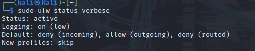
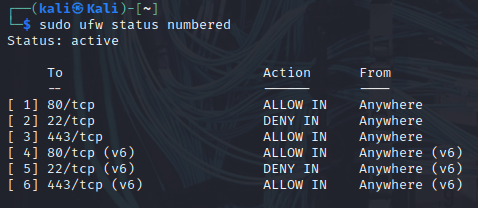
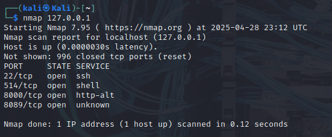

# Firewall-Setup

A simple project to configure a basic firewall on a Kali Linux machine using **UFW** (Uncomplicated Firewall). This project focuses on setting secure defaults, allowing specific traffic, denying unnecessary access, and verifying everything with basic scanning.

---

## Lab Goals

- Enable and configure UFW firewall
- Set default rules (deny incoming, allow outgoing)
- Allow HTTP (port 80) and HTTPS (port 443) traffic
- Deny SSH (port 22) access
- Verify firewall behavior with `nmap`
- Capture screenshots for documentation

---

## Commands Used

```bash
# Enable UFW
sudo ufw enable

# Check status
sudo ufw status verbose

# Allow HTTP traffic (port 80)
sudo ufw allow 80/tcp

# Allow HTTPS traffic (port 443)
sudo ufw allow 443/tcp

# Deny SSH traffic (port 22)
sudo ufw deny 22/tcp

# Show rules with numbers
sudo ufw status numbered

# Nmap scan to verify open ports
nmap 127.0.0.1
```

---

## Results

- **Default Policy:**
  - Incoming: Deny
  - Outgoing: Allow
  - Routed: Deny
- **Allowed Ports:**
  - 80/tcp (HTTP)
  - 443/tcp (HTTPS)
- **Denied Ports:**
  - 22/tcp (SSH)
- **Nmap Results:**
  - Some other services were detected due to pre-existing configurations (e.g., 514/tcp, 8000/tcp, 8089/tcp).

---

## Screenshots

Screenshots are stored in the `screenshots/` folder:

 - UFW status before rules were applied

 - UFW rules with numbered output showing configured rules

 - Nmap scan results verifying firewall behavior

---

## Lessons Learned

- UFW is a quick and effective way to secure a Linux machine.
- It's important to verify open ports with tools like Nmap even after setting firewall rules.
- Service configurations (e.g., SSH running by default) can affect what ports are open and need to be considered separately from firewall settings.

---

## Improvements for Future Labs

- Explore creating UFW profiles for specific services.
- Set up logging at a higher verbosity to monitor denied traffic.
- Implement rate limiting or connection throttling for brute-force protection.

---

> Part of the "Cybersecurity-Projects" series.

